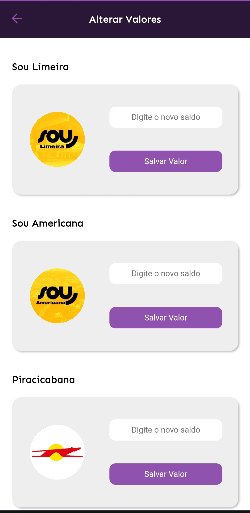

# Projeto Grape Ônibus

Este projeto partiu de uma necessidade pessoal, gerenciar os gastos com passagens de ônibus em meu dia a dia, em minha ida e volta da faculdade. Pensando nisso veio em minha mente criar um aplicativo para o ambiente android, mas eu não tinha recursos de hardware necessário para isso. Sendo assim criei um PWA com o nome de Grape Ônibus para me auxiliar com a tarefa.

> ⚠ Embora o projeto seja um PWA e possa ser acessado em ambiente desktop e mobile, seu design foi pensado exclusivamente ao mobile, já que eu gostaria de usar o conteúdo ao longo do meu dia.

---

# Funcionalidades

O PWA sana algumas necessidades que tinha em relação a como gerenciar meus gastos com passagens de ônibus, sendo assim ele proporciona:

- Visualizar o dia da semana em que está, proporcionando uma melhor noção de até quando os saldos das passagens podem durar.
- Mostrar a quantidade de saldos disponíveis em cada empresa de ônibus que utilizo, e ainda um saldo total.
- Advertir a aproximação do fim dos saldos em forma de cores(verde, amarelo e vermelho) acima dos dados de cada empresa.
- Mostrar quantas viagens e quantos dias são possíveis de completar com o saldo atual de cada empresa de ônibus.
- Oferecer um botão de subtração de dia, para que ao final do dia possa ser debitado e atualizado o saldo.
- Ofercer botões de subtração de saldo individual para cada empresa de ônibus.
- Possibilidade de alteração de valores caso acontece alguma recarga ou debito acidental de saldo.

Essas funcionalidades atuam em conjunto para uma melhor visualização e projeção de dias e saldos disponíveis durante um período. Foi pensado especialmente para uso diário, por isso as opções de subtração por dia.

---

# Como usar

Acesse o site(Pelo celular, já que para desktop o site não é otimizado):

[Clique aqui para visualizar](https://guh-santosz.github.io/grape-PWA/)

Caso não queira baixar siga apenas o passo a cima, mas caso queira testar a plicação instalada siga os seguintes passos:

- Passo 1: Após acessar o site, deve aparecer esse ícone em sua tela:

clique em "Install" ou "Instalar"

- Passo 2: A aplicação vai ser instalada:

- Passo 3: Após isso é só clicar no ícone em seu telefone:

# Mas e se o ícone não aparecer?

Caso o icone com "Install" não apareça, siga esses passos:

- Passo 1: Clique nos três pontinhos no canto superior direito da tela:

- Passo 2: Após isso deve aparecer essa barra:

Clique em "Add to home screen" ou "Adicionar à tela principal"

- Passo 3: Clique em "Install" ou "Instalar":

- Passo 4: Clique novamente em "Install" ou "Instalar":

Após isso a aplicação será instalada e adicionada a sua tela inicial:

---

# Imagens de Demonstração

Aqui vão as telas do site, sendo elas a tela principal:

Tela de alteração de valores:

